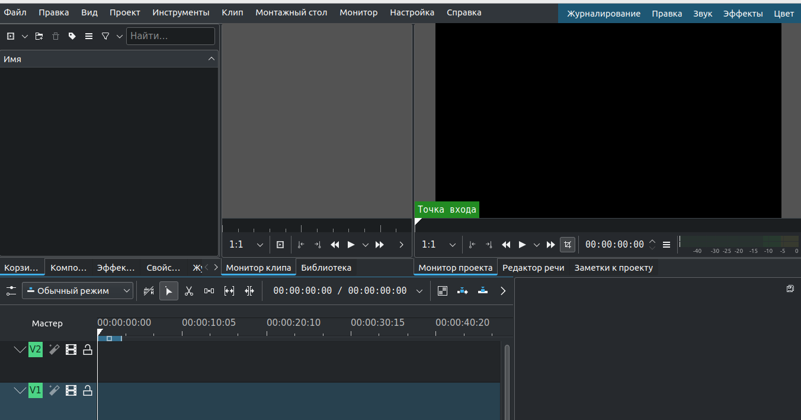

- про
  ▪ Kdenlive — це абревіатура KDE Non-Linear
  Редактор відео.
  ▪ Насамперед орієнтований на платформу Linux, але також
  працює на Mac або Windows. Для завантаження відвідайте
  https://kdenlive.org/en/download/
  ▪ Безкоштовне програмне забезпечення з відкритим кодом згідно з
  умови GNU General Public License.
- особливості
  ▪ Редагування відео з кількома відстеженнями: дозволяє використовувати
  декілька аудіо та відео доріжок.
  ▪ Kdenlive може використовувати майже будь-яке аудіо-відео
  форматів. наприклад: **webm, avi, mp4, ogg, 3gp, wav** …
  ▪ Вбудований редактор заголовків для створення, переміщення, обрізання та форматування тексту, додавання зображень тощо.
	- особливості
	  ▪ Автоматичне резервне копіювання кожні кілька хвилин.
	  ▪ Можливість додавати спеціальні ефекти та переходи
	  діапазон корекції кольорів для налаштування звуку.
	  ▪ Може відтворюватися у багатьох форматах, наприклад. webm, mp4,
	  aac тощо
- **Explore the interface**
	- 
- **Explore the interface**
-