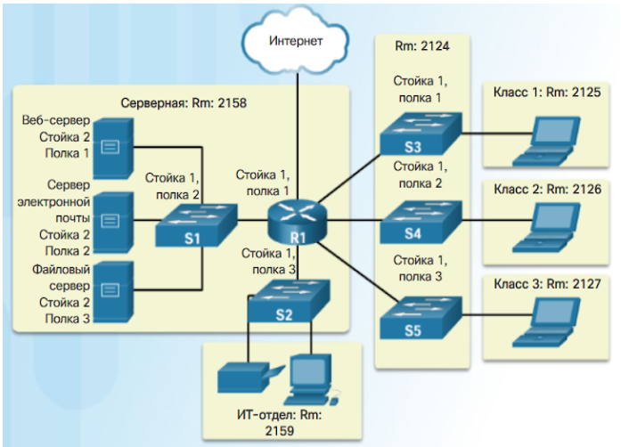
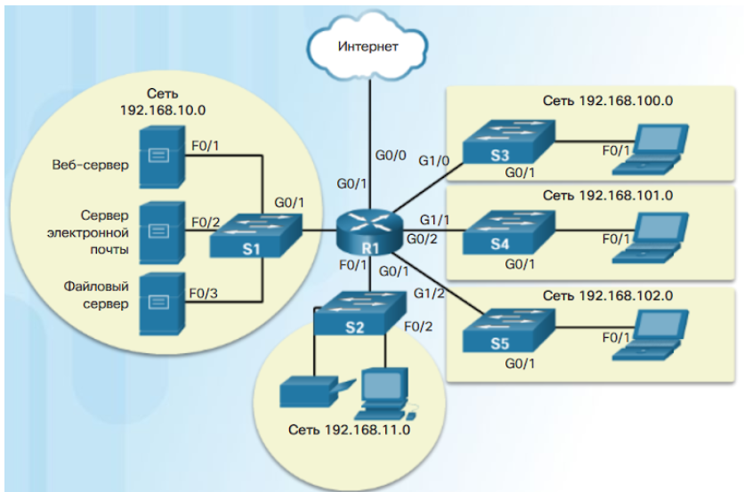
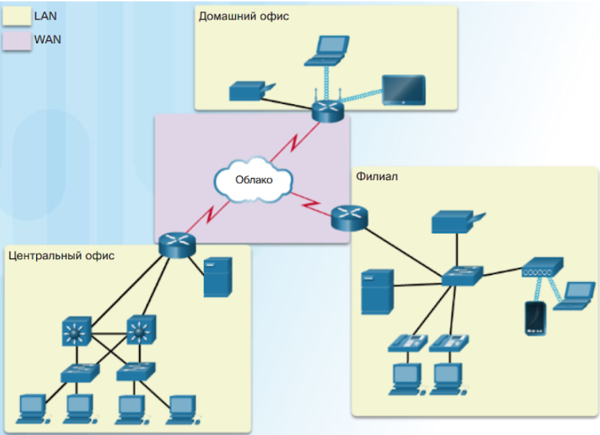

- Существует два типа топологических схем.
- **Схемы физической топологии** — физическое расположение промежуточных устройств и кабельных линий (см. рис 1).
- 
- pic 1
- **Схемы логической топологии** — определение устройств, портов и схемы адресации (см. рис. 2)
- 
- pic 2
- Сетевые инфраструктуры могут значительно отличаться по следующим критериям:
	- размер площади покрытия;
	- количество подключенных пользователей;
	- количество и типы доступных служб;
	- область ответственности.
- ## два наиболее распространенных типа сетевой инфраструктуры:
- **Локальная сеть (LAN) **— сетевая инфраструктура, предоставляющая доступ пользователям и оконечным устройствам на небольшой территории; обычно является домашней сетью, сетью малого или крупного предприятия, управляется одним лицом или ИТ-отделом и принадлежит им.
- **Глобальная сеть (WAN)** — сетевая инфраструктура, предоставляющая доступ к другим сетям на большой территории; обычно принадлежит провайдерам телекоммуникационных услуг и находится под их управлением.
- Другие типы сетей:
- **Городская сеть (Metropolitan Area Network, MAN) **— сетевая инфраструктура, которая охватывает территорию больше, чем локальная сеть, но меньше глобальной сети (например, город). Как правило, управляет городскими сетями одна организация, например, крупный сетевой оператор.
- **Беспроводные локальные сети (WLAN)** — аналогичны локальным сетям, но соединяют пользователей и оконечные устройства на небольшой территории с помощью беспроводной связи.
- **Сеть хранения данных (SAN) **— сетевая инфраструктура, разработанная для поддержки файловых серверов, хранения данных, их получения из хранилища и репликации.
- 
-