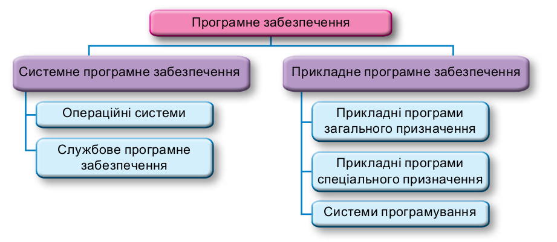

- 
- **Системне програмне забезпечення** призначено для:
  •• керування роботою складових комп’ютера;
  •• забезпечення обміну даними між пристроями комп’ютера;
  •• діагностування та усунення недоліків у роботі комп’ютера;
  •• автоматизації процесу опрацювання даних;
  •• організації обміну даними між користувачем і комп’ютером.
- **Прикладне програмне забезпечення** призначено для реалізації конкретних
  завдань опрацювання даних, які користувач здійснює у процесі своєї професійної
  (навчальної) та побутової діяльності. Їх поділяють на прикладні програми загаль-
  ного і спеціального призначення та системи програмування.
  До прикладних програм **загального призначення** належать програми, які можуть
  застосовуватися в різних галузях людської діяльності для опрацювання текстів, ма-
  люнків, мультимедійних даних, електронних таб­лиць, створення презентацій тощо.
  Прикладні програми **спеціального призначення** використовують для реалі-
  зації специфічних завдань опрацювання даних у певній галузі діяльності, на кон-
  кретному підприємстві, в організації, фірмі або їх підрозділі. До такого типу про-
  грам належать програми для фінансових і бухгалтерських обчислень, створення
  відеоефектів під час виробництва кінофільмів, креслень машин і механізмів у кон-
  структорських і проєктних бюро, діагностування захворювань у медичних закла-
  дах, створення шкільного розкладу уроків тощо
- **Системи програмування** призначені для створення нових програм з ви-
  користанням мов програмування.
- Операційні системи призначені для
  •• керування роботою пристроїв комп’ютера;
  •• забезпечення обміну даними між складовими комп’ютера;
  •• зберігання даних в оперативній пам’яті та на зовнішніх носіях;
  •• забезпечення виконання інших програм;
  •• організації обміну даними між користувачем і комп’ютером.
  ОС є основою всього службового програмного забезпечення. Основними скла-
  довими операційної системи є:
  •• базова система введення/виведення – BIOS – незалежний від конкрет-
  ної версії операційної системи набір базових команд, які використовуються
  для забезпечення обміну даними між пристроями;
  •• ядро операційної системи – набір програм, з використанням яких здійс-
  нюється виконання команд, розподіляються ресурси пам’яті та каналів
  зв’язку між пристроями і програмами, надаються розширені можливості
  з керування пристроями комп’ютера та ін.;
  •• файлова система – складова, яка визначає структуру збереження даних
  на зовнішніх носіях і сукупність програм, які забезпечують роботу із цією
  структурою. Зазвичай операційна система може працювати з кількома фай-
  ловими системами;
  •• драйвери пристроїв (англ. driver – водій, керуючий пристроєм) – програ-
  ми, які забезпечують обмін даними між операційною системою і конкретною
  моделлю пристрою;
  •• інтерфейс користувача (англ. interface – засоби узгодження) – сукупність
  засобів, які забезпечують обмін даними між користувачем і ОС.
-