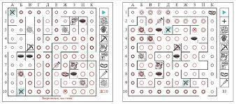

- **1. Лабиринт с предметами**
- Играют двое. Игроки рисуют по два поля 10х10. Для удобства можно присвоить клеткам обозначения: а, б, в, … , и, к – по горизонтали и 1, 2, 3, … , 9, 10 – по вертикали. (Помогает при общении по игре). На одном поле чертиться свой лабиринт, по которому будет ходить соперник. Второе, пока пустое, поле – лабиринт соперника, по которому ходит сам игрок. На нем отмечаются разведанные в процессе игры объекты лабиринта противника. Цель – вынести клад из чужого лабиринта быстрее чем соперник вынесет клад из твоего.
- Тут появляется возможность одновременно проявить себя и как приключенец и как «хозяин подземелья».
- **Требования к лабиринту:**
- Между клетками могут находиться стены, которые, собственно, лабиринт и образуют. Кроме этого, весь лабиринт по периметру также огражден стеной, которая называется «стена лабиринта».
- **В лабиринте должны находиться:**
- 1 Арбалет
- 1 Костыль
- 1 Капкан
- 4 Ямы
- 4 Выхода из ям (каждой яме однозначно соответствует один выход)
- 3 Ложных клада
- 1 Настоящий клад
- 4 Выхода из лабиринта с каждой стороны.
- Кроме того, каждый участник в начале игры имеет 3 гранаты.
- **Пример карты:**
- {:height 157, :width 338}
-
- **Игровой процесс.**
- Игроки говорят друг другу координаты точек, с которых они хотели бы начать игру.
- Игроки ходят по очереди. За ход игрок может переместиться на одну клетку вправо, влево, вверх или вниз, если клетку в которой он находится и ту, в которую желает переместиться, не разделяет стена. В случае, если такая стена все-таки присутствует, игроку об этом сообщается и он остается на своей клетке до следующего хода. Если эта стена является стеной лабиринта, об этом сообщается отдельно. Впрочем, по предварительной договоренности, можно не делать различий между внутренними стенами и стенами лабиринта и исключить понятие «стена лабиринта», но это может сильно затянуть игру. Потратив одну гранату, игрок может устранить любую стену (в т.ч. и стену лабиринта) до конца игры. Для этого не нужно ее сначала обнаруживать. Скажем, интуитивно почувствовав, что справа стена, игрок может не тратить ход на то, чтобы сходить вправо и убедиться в ее наличии. Он сразу может использовать гранату, и уж тогда там точно не будет стены. Но может быть, что ее там и не было, тогда граната все равно считается потраченной. Бросок гранаты считается ходом. Бросить гранату и переместиться в этот же ход нельзя.
- После того как игрок переместился на новую клетку, противник сообщает ему о том, что на новой клетке находится (а на одной клетке может находиться только один объект).
- Это могут быть (с примерами обозначения):
- а) **арбалет** («А»). После посещения этой клетки, игрок начинает «хромать» и противник за свой ход (уже наступивший) может совершить +1 действие (переместиться, кинуть гранату, наткнуться на стену). Арбалет срабатывает один раз, но его действие длится до конца игры.
- б) **костыль** («Y»). Посещение этой клетки дает самому игроку, начиная со следующего хода, совершать за ход на 1 действие больше. Это не лекарство от действия арбалета, а самостоятельный объект. Костыль срабатывает один раз, но его действие длится до конца игры.
- Действия костыля и арбалета складываются. Т.е., посещение обеих этих клеток дает тот же результат, что и непосещение ни одной из них. Если же Вы нашли костыль, а Ваш противник арбалет, то за ход Вы можете сделать уже три действия (не четыре!).
- в) **капкан** («K»). Попуск трех ходов. Т.е. пока Вы выбираетесь из капкана (корректнее — ловушки), противник совершает четыре хода, после чего Вы опять можете перемещаться. Наличие у противника костыля позволяет ему совершить восемь ходов. Если Вы попали в капкан будучи перед этим ранены арбалетом, противник делает лишь четыре хода (перманентный пропуск ходов не работает, т.к. Вы все равно не двигаетесь). Капкан срабатывает каждый раз, когда игрок посещает клетку с ним.
- г) **Вы попали в яму** № 1, 2, 3 или 4. («1,2,3,4») – мгновенное перемещение (тем же ходом) на клетку «Выход из ямы № 1, 2, 3 или 4» («I,II,III,IV») соответственно. Координаты выхода игроку не сообщаются. Он продолжает игру от клетки с выходом из ямы и сам определяет свое местоположение по косвенным признакам. Если игрок попал на клетку «выход из ямы» не падая в саму яму а просто «набрел», ему сообщается об этом. Теперь, упав в яму с этим номером, он будет знать, где появится.
- д) **Вы нашли клад**. Ложный («О») или истинный («Х»), можно узнать только выйдя из лабиринта.
- Для выхода из лабиринта можно воспользоваться любым из выходов, которые имеются по одному с каждой стороны или пробить новый, воспользовавшись гранатой. (Впрочем, можно условиться, что стены лабиринта гранаты не берут, хотя при этом тратятся).
- Игроку, который в свой ход вышел из лабиринта (случайно или преднамеренно), сообщается, что он вышел из лабиринта. Если при этом у него на руках клад, сообщается и какой это клад: ложный или настоящий.
- Одновременно можно нести только один клад. При этом действия арбалета, костыля, капкана не отменяются. Бросать клад где вздумается нельзя, но можно менять один на другой. Брать клад не обязательно. Если оказавшись на клетке с кладом Вы решили его взять, об этом нужно сообщить противнику.
- Лабиринт должен составляться таким образом, чтобы можно было посетить каждую клетку и выйти из лабиринта без применения гранат, начав игру из любой точки. Нельзя строить ловушки: когда игрок, попав в яму, выходит из нее в замкнутое пространство, из которого не может выбраться без применения гранат. Капкан может стоять где угодно.
- Выйдя из лабиринта, игрок может зайти только в тот выход, из которого вышел. Впрочем, вариант с возможностью повторного захода через любой выход тоже имеет право на существование. В этом случае можно отгораживать участки, попасть в которые можно только через определенный вход в лабиринт, если начальная точка находится за их пределами.
-
-