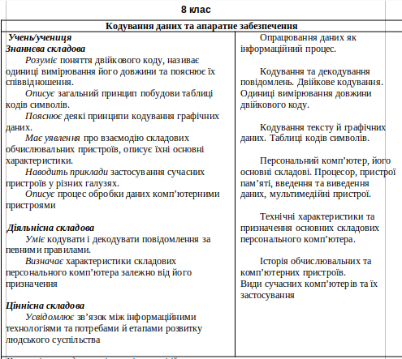

title:: Очікування по темі "Кодування даних та апаратне забезпечення"

- **Знаннєва складова**
- Учень/учениця:
- Розуміє поняття двійкового коду, називає одиниці вимірювання його довжини та пояснює їх 
  співвідношення.
  Описує загальний принцип побудови таблиці кодів символів.
  Пояснює деякі принципи кодування графічних даних.
  Має уявлення про взаємодію складових обчислювальних пристроїв, описує їхні основні характеристики.
  Наводить приклади застосування сучасних пристроїв у різних галузях. 
  Описує процес обробки даних комп’ютерними пристроями
- **Діяльнісна складова**
  Уміє кодувати і декодувати повідомлення за певними правилами.
  Визначає характеристики складових персонального комп’ютера залежно від його призначення
- **Ціннісна складова** 
  Усвідомлює зв’язок між інформаційними технологіями та потребами й етапами розвитку людського суспільства
-
- 
- [[Данные]]
-