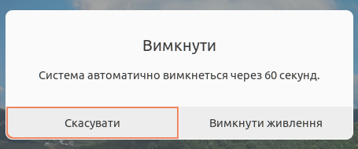

## Порядок вмикання комп'ютера
- Увімкни монітор
  logseq.order-list-type:: number
- Натисни кнопку POWER на системному блоці. Дочекайся завантаження операційної системи
  logseq.order-list-type:: number
- На екрані з'явилося зображення робочого стола. Комп'ютер готовий до роботи.
  logseq.order-list-type:: number
- ## Порядок вимикання комп'ютера
- Заверши роботу всіх програм
  logseq.order-list-type:: number
- Вимкни принтер, дістань диск, коректно заверши роботу з флешкою.
  logseq.order-list-type:: number
- Натисни на системному блоці кнопку POWER, після цього на екрані з'явиться вікно "Вимкнути"
  logseq.order-list-type:: number
	- 
- Клацни кнопку "Вимкнути живлення"
  logseq.order-list-type:: number
- **ДОЧЕКАЙСЯ** вимкнення комп'ютера і потім **ВИМКНИ МОНІТОР**
  logseq.order-list-type:: number