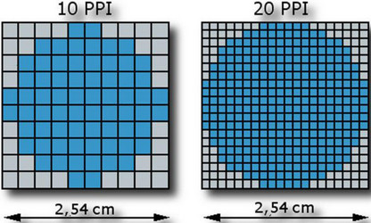

- 
- У смартфонах щільність пікселів може досягати 550 PPI, тоді як у телевізорах і в моніторах цей показник рідко перевищує 100 PPI. Ця величина вказує, скільки точок розташовано на дюйм, з огляду на його висоту й ширину.
-